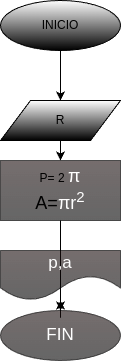

# Programa #1
programa para calcular el area y el perimetro de un circulo  de radio r 

# analisis
  ## imput
  ### variable de entrada
  r:  radio del circulo
  ### processing 
  p= 2πr
  p:perimetro del circulo
  a= πrr
  a:area del circulo
  ### output
  a,p
# diseño

# construccion
